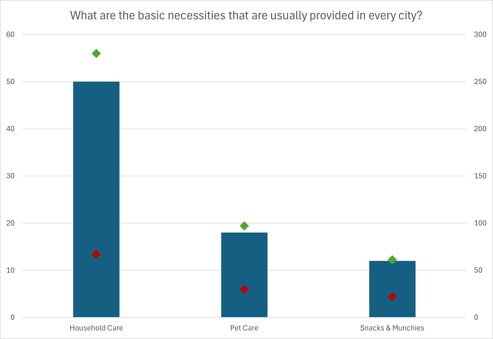
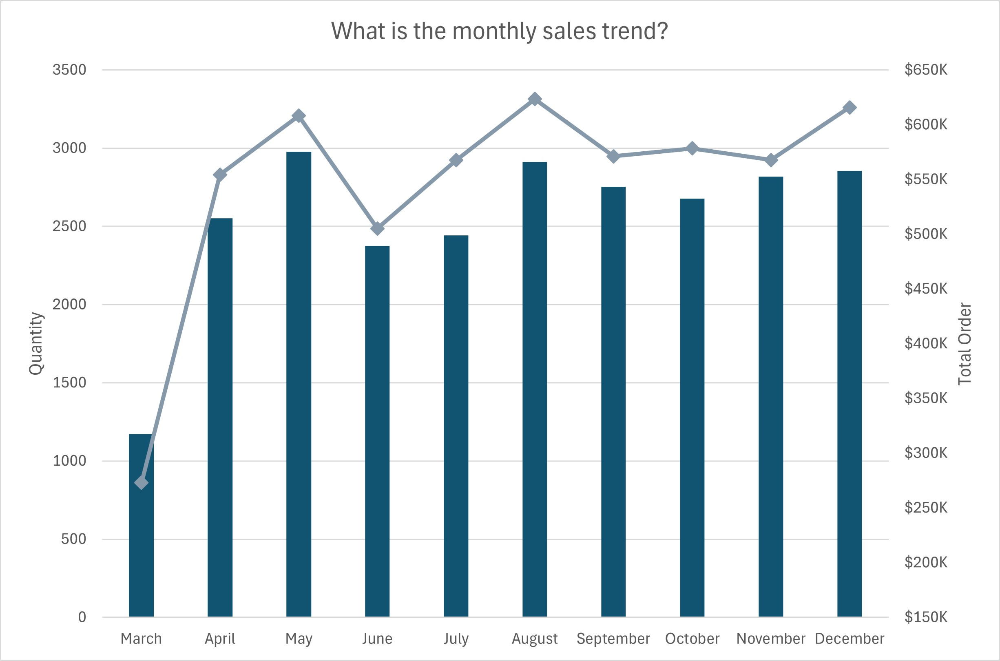
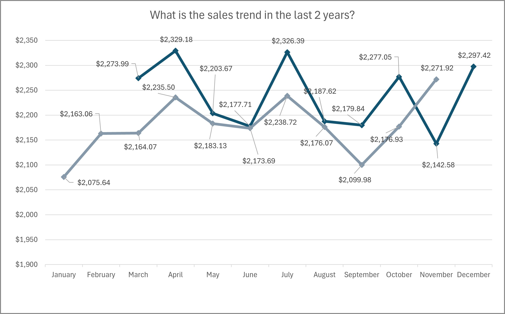
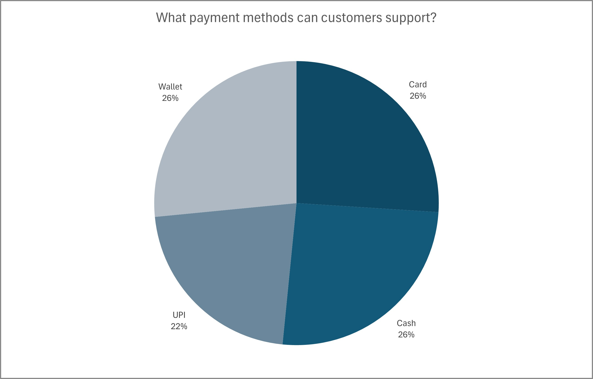
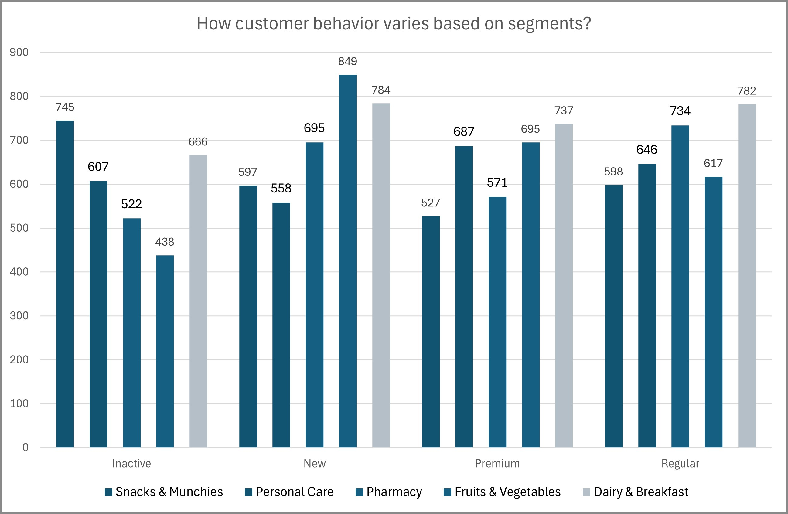
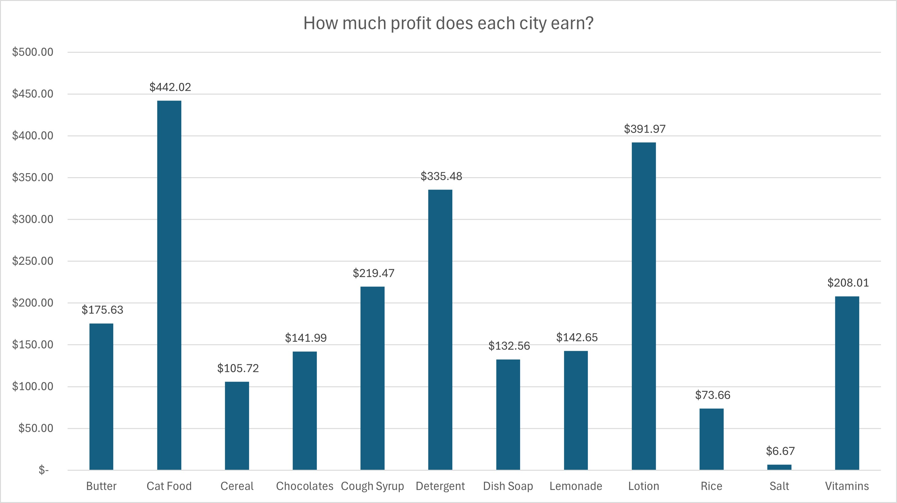
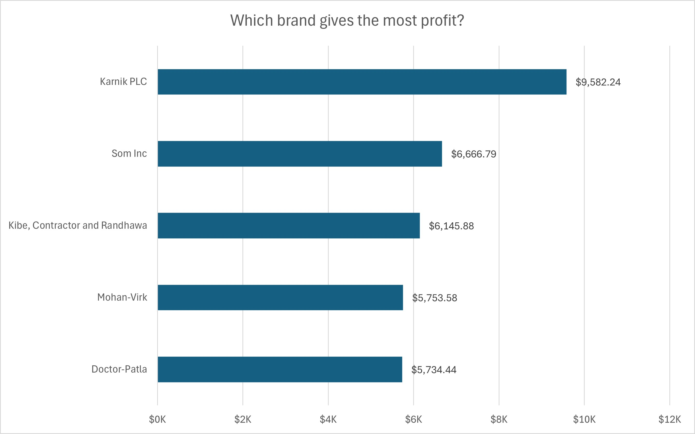
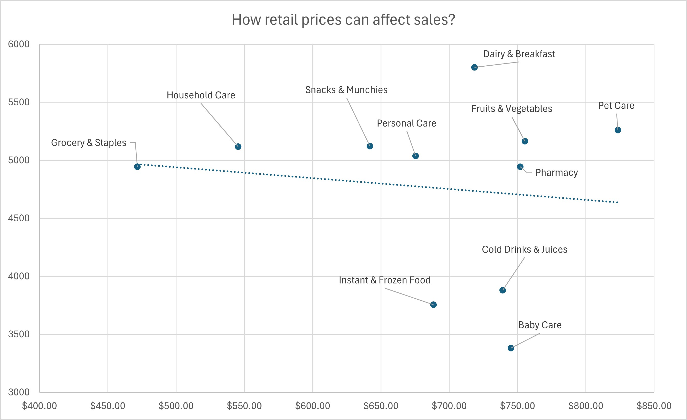

# 📊 Data Analyst Portfolio – Excel Pivot Table Analysis

## 📌 Project Introduction
Repository ini merupakan portofolio **Data Analyst** yang berfokus pada analisis data menggunakan **Microsoft Excel**, dengan pemanfaatan **Pivot Table, Power Query, dan Power Pivot**.  
Project ini bertujuan untuk menunjukkan kemampuan dalam melakukan **data cleaning, data modeling, exploratory analysis, serta interpretasi insight bisnis**.

---

## 🏢 Dataset Overview
Pada analisis kali ini digunakan dataset dari **Blinkit E-Commerce**, sebuah platform e-commerce yang menjual berbagai kebutuhan dan peralatan rumah tangga.

### 📂 Database Structure
Struktur database **BLINKIT** terdiri dari **8 tabel utama**, yaitu:
- Customer  
- Product  
- Order  
- Order Item  
- Delivery  
- Customer Feedback  
- Marketing Performance  
- Payment Method  

📌 **Entity Relationship Diagram (ERD):**  

---

## 🎯 Analysis Objectives
Tujuan dari analisis ini adalah:
- Menganalisis **perilaku konsumen** dalam melakukan transaksi online
- Mengidentifikasi **kebutuhan dan preferensi customer** selama **2 tahun terakhir**
- Memberikan insight berbasis data untuk mendukung:
  - Inventory management  
  - Strategi pemasaran  
  - Optimalisasi penjualan  

---

## 🛠️ Tools & Technologies
- **SQL**
  - Data cleaning
  - Data preparation
- **Microsoft Excel**
  - Power Query (Data Transformation)
  - Power Pivot (Data Modeling & Measures)
  - Pivot Table (Analysis)
  - Charts & Visualization

---

## 🔄 Data Processing Workflow
1. **Data Cleaning**
   - Menghapus duplikasi data
   - Menangani missing values
   - Standarisasi format data  
   *(Dilakukan menggunakan SQL)*

2. **Data Transformation & Modeling**
   - Membuat relasi antar tabel
   - Pembuatan calculated column & measures  
   *(Menggunakan Power Query & Power Pivot)*

3. **Data Analysis & Visualization**
   - Analisis menggunakan Pivot Table
   - Visualisasi insight menggunakan chart Excel

---

## ❓ Business Questions
Berdasarkan pemahaman awal terhadap data, analisis ini menjawab beberapa pertanyaan berikut:
1. What are the basic necessities that are usually provided in every city?
2. What is the sales trend in the last 2 years?
3. What payment methods can customers support?
4. How customer behavior varies based on segments?
5. How much profit does each city earn?
6. Which brand gives the most profit?
7. How retail prices can affect sales?

---

## 📈 Key Insights & Findings

### 1️⃣ Product & Brand Preference
Dengan memahami kebutuhan customer yang cenderung memilih pembeliannya berdasarkan produk dan brand tertentu, perusahaan perlu memperhatikan kapasitas penyimpanan barang yang disesuaikan dengan pola dan volume pembelian saat ini.  
Pengelolaan kapasitas penyimpanan yang tepat dapat mengurangi risiko **overstock** dan **stockout**, serta memastikan kebutuhan customer terpenuhi secara optimal.

📊 **Visualization:**  

---

### 2️⃣ Sales Trend Analysis (2 Years)
Tren penjualan selama dua tahun terakhir menunjukkan pola yang **fluktuatif**, sehingga sulit untuk langsung mengidentifikasi arah pertumbuhan.  
Oleh karena itu, analisis dilanjutkan dengan **rata-rata penjualan bulanan** guna memperoleh gambaran performa yang lebih stabil.

📊 **Visualization:**  

---

### 3️⃣ Quarterly Sales Momentum
Terdapat penurunan total penjualan dari tahun 2023 ke 2024. Namun, momentum puncak pembelian masih terjadi pada periode yang sama setiap tahunnya, yaitu pada bulan **April, Juli, dan Oktober**.  
Informasi ini dapat dimanfaatkan oleh tim inventory sebagai acuan dalam pengelolaan ruang penyimpanan, serta oleh tim marketing dan sales untuk mengoptimalkan strategi penjualan musiman.

📊 **Visualization:**  

---

### 4️⃣ Payment Method Analysis
Meskipun kebutuhan customer berubah dari waktu ke waktu, metode pembayaran yang digunakan cenderung merata di seluruh segmen customer, mulai dari **Inactive hingga Premium**.  
Namun, metode pembayaran **Cash** memiliki persentase penggunaan sekitar **3% lebih tinggi dari rata-rata**.  
Selain segmentasi customer, faktor usia juga perlu diperhatikan dalam analisis kemudahan dan preferensi metode pembayaran.

📊 **Visualization:**  

---

### 5️⃣ Customer Segment Behavior
Pembelian paling banyak dilakukan oleh customer pada segmen **Regular dan Premium**, yang kemungkinan dipengaruhi oleh tingkat pemahaman dan edukasi terhadap produk.  
Segmen ini cenderung melakukan pembelian secara rutin dan memberikan dampak signifikan terhadap penjualan.  
Insight ini dapat dimanfaatkan untuk memberikan **special treatment** guna meningkatkan loyalitas pelanggan.

📊 **Visualization:**  

---

### 6️⃣ City-Based Profit Analysis
Setiap daerah memiliki kebutuhan yang berbeda. Informasi ini dapat dimanfaatkan oleh tim inventory untuk mengoptimalkan pemanfaatan ruang penyimpanan sesuai dengan kebutuhan masing-masing wilayah, sehingga dapat meningkatkan efisiensi dan potensi penjualan.

📊 **Visualization:**  

---

### 7️⃣ Brand Preference by City
Setelah mengetahui produk yang paling diminati, pemahaman terhadap **brand preference di setiap kota** menjadi penting.  
Beberapa segmen customer sangat mempertimbangkan brand dalam keputusan pembelian, sehingga insight ini dapat digunakan untuk menyusun strategi pemasaran dan perencanaan inventory yang lebih tepat sasaran.

📊 **Visualization:**  

---

### 8️⃣ Price vs Sales Analysis
Analisis menunjukkan bahwa variabel harga tidak memiliki hubungan yang sangat kuat dengan daya beli customer.  
Customer cenderung tetap membeli produk berdasarkan kebutuhan, terutama pada kategori **Dairy & Breakfast** dan **Pet Care**, meskipun terjadi fluktuasi harga.  
Faktor kesehatan, kualitas, dan brand memiliki pengaruh yang lebih besar dibandingkan harga pada beberapa segmen dan kategori produk.

📊 **Visualization:**  

---

## 📁 Project Files
- `data_cleaning.sql` → SQL cleaning script  
- `blinkit_analysis.xlsx` → Excel analysis (Pivot Table, Power Query, Power Pivot)  
- `images/` → Visualizations & ERD  

---

## 🚀 Conclusion
Analisis ini memberikan pemahaman mendalam mengenai perilaku konsumen, preferensi produk dan brand, serta pola penjualan yang dapat dimanfaatkan untuk:
- Optimalisasi inventory
- Strategi pemasaran berbasis data
- Peningkatan performa penjualan

---

## 📬 Contact
- **LinkedIn:** www.linkedin.com/in/brahmantio-w
- **Email:** brahmantio25@gmail.com
